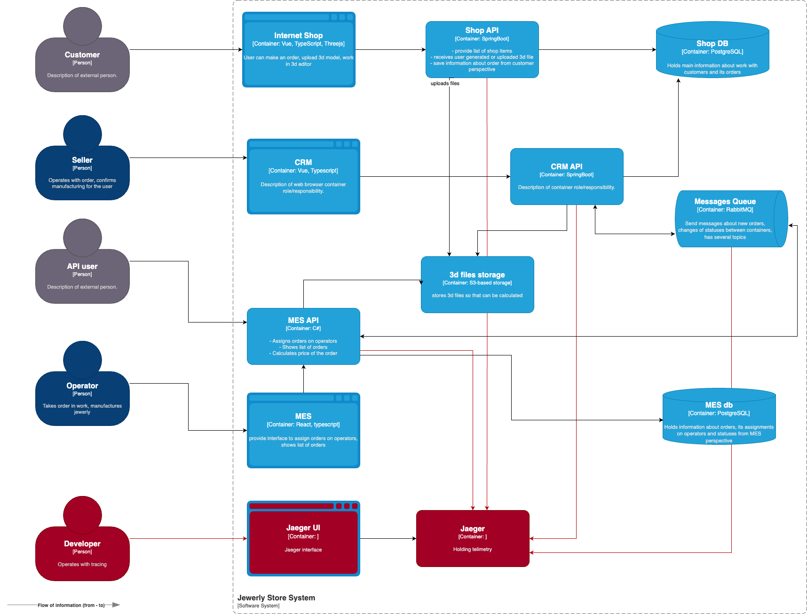

## Мотивация
Зачем нужен трейсинг:
- покажет на каком этапе теряются заказы
- повысит скорость обнаружения проблем
- поможет отлавливать неочевидные ошибки

За счет этого уменьшится количество жалоб и увеличится скорость выполнения заказов.

## Предлагаемое решение

Использование OpenTelemetry для сбора метрик производительности всех микросервисов и анализа трейсинга, 
чтобы понять, на каком этапе запроса возникают задержки, Jaeger – для хранения и визуализации.

### Данные, которые должны попадать в трейсинг
- trace_id
- span_id
- timestamp
- duration
- order_id, order_status
- user_id
- endpoint

## Компромиссы
- Внедрение трейсинга в MES может быть дорогостоящим
- Потребуются дополнительные ресурсы для хранения трассировок

## Безопасность

- Доступ только для пользователей с ролью devops, developer 
- Шифрование трафика
- Маскирование данных
