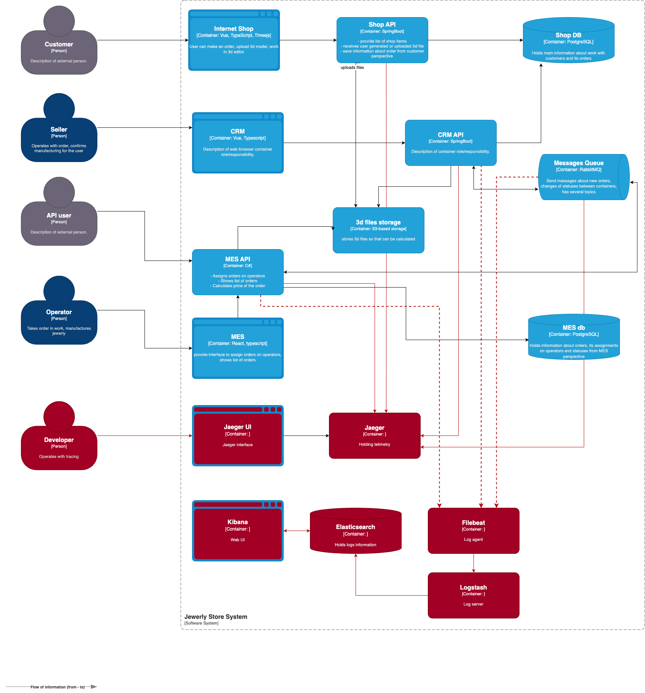

## Мотивация

Логирование необходимо для:

- более быстрого обнаружения ошибок и их исправления
- получения информации о проблеме и том как ее воспроизвести

В первую очередь логи необходимо добавить в

1. MES, т.к это наиболее сложная часть системы и в ней больше всего потенциальных проблем
    - создание заказа, INFO: order_id, user_id, timestamp
    - изменение статуса заказа, INFO: order_id, status, timestamp
    - ошибки при изменении статуса заказа, ERROR: error, order_id, timestamp
2. CRM API, RabbitMQ - чтобы понять на каком этапе и почему теряются заказы
    - изменение статуса заказа, INFO: order_id, status, timestamp

## Предлагаемое решение

Использовать стек ELK для работы с логами

## Безопасность

- Маскирование данных
- Шифрование трафика
- Доступ только для пользователей с ролью devops, developer, support

## Политика хранения

- Отдельный индекс для каждой системы
- ERROR логи хранятся 30 дней, остальные 14 дней

## Система анализа логов

- Настроить Kibana Alerting при увеличении количества ошибок (например, > 10 ошибок в минуту)
- Настроить дашборды в Kibana для отслеживания активности

## Критерии

| Критерий	         | ELK             | OpenSearch          | Splunk        |
|-------------------|-----------------|---------------------|---------------|
| Лицензия	         | Elastic License | Apache 2.0          | Проприетарная | 
| Стоимость         | Бесплатно       | Бесплатно           | Высокая       | 
| Масштабируемость	 | Хорошая         | Высокая             | Отличная      | 
| Поддержка         | Сообщество      | Активное сообщество | 24/7 Platinum |
| Безопасность	     | Basic           | Basic               | Enterprise    | 

