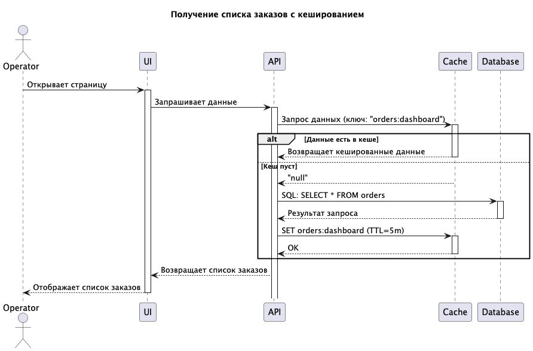

## Мотивация

Кеширование поможет решить проблему медленной загрузки первой страницы (на что жалуются операторы),
и соответственно, ускорить обработку и выполнение новых заказов.
Кеширование списка заказов снизит нагрузку на БД и увеличит отклик приложения.

## Предлагаемое решение

Выбран серверный тип кеширования, потому что проблема возникает
при загрузке данных из БД и клиентское кеширование не поможет решить эту проблему.

В качестве паттерна выбран Cache-Aside, т.к. он больше всего подходит для данных,
которые часто читаются и редко изменяются.

Write-Through больше подходит для приложений, где преобладают операции записи.
Refresh-Ahead сложнее внедрять, должен работать без ошибок, чтобы предоставлять актуальные данные,
требуется качественная система мониторинга.

## Стратегии инвалидации кеша

| Стратегия                           |                                                                                       |
|-------------------------------------|---------------------------------------------------------------------------------------|
| Инвалидация по ключу                | Подходит, можно инвалидировать данные по заданому ключу                               |
| Временная инвалидация               | Не подходит, данные могут устареть раньше, чем истечет время                          |
| Инвалидация, основанная на запросах | Не подходит, при высокой активности пользователей кеш будет слишком часто обновляться |
| Инвалидация на основе изменений     | Не подходит, сложно реализовывать                                                     |
| Программная инвалидация             | Подходит, можно явно указывать при каких условиях и какие данные нужно инвалидировать |

